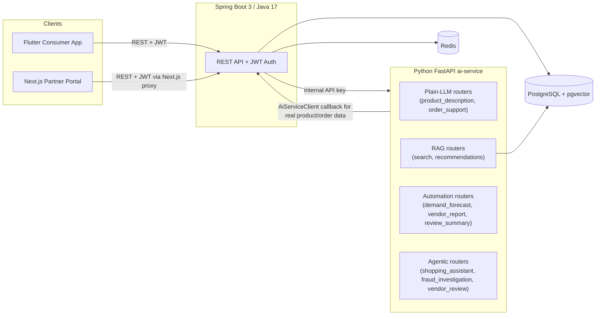

# NearNow

A Blinkit-style quick-commerce platform with a full applied-AI layer — Spring Boot backend, Flutter consumer app, Next.js partner portal, and a dedicated Python AI microservice, running as one Docker Compose stack.


---

## Overview

NearNow implements a **1P (platform-owned) inventory model**: the platform, not individual vendors, owns stock state and decides when to restock, so a customer order deterministically reserves real inventory instead of pinging a marketplace of sellers in real time. On top of that commerce core sits an **applied-AI layer** — semantic product search, an order-support and shopping-assistant chat agent, a two-step (cheap-check-then-LLM) fraud investigation agent, a vendor-onboarding review agent, AI-written review summaries, demand forecasting, and OCR-assisted vendor onboarding — all backed by Google Gemini and a PostgreSQL/pgvector RAG store. This is not a CRUD app with a chatbot bolted on; the AI layer reads and writes real backend state through an internal authenticated API, and every irreversible AI decision is gated behind human approval.

## Architecture



The AI service never talks to Postgres directly — it calls back into Spring Boot through `AiServiceClient` (Java side) using a shared `INTERNAL_API_KEY`, so the backend stays the single source of truth for all business data, including the vector-search index.

## Tech stack

| Layer | Stack |
|---|---|
| Backend | Spring Boot 3.2.5, Java 17, Spring Security (JWT), Spring Data JPA, Testcontainers 1.20.4 |
| AI Service | FastAPI, LangGraph, LangChain-Google-GenAI, `google-genai`, Redis client, Pillow + pytesseract (OCR) |
| Database | PostgreSQL 16 with the `pgvector` extension (semantic search / RAG) |
| Cache | Redis 7 |
| Mobile | Flutter (SDK ^3.3.0), Provider state management, Firebase Cloud Messaging (client-ready) |
| Web Portal | Next.js 15.5, React 19.1, TypeScript 5.9, Tailwind CSS 3.4 |
| DevOps | Docker Compose (7 services incl. monitoring profile), Prometheus + Grafana, GitHub Actions |

## Key design decisions

Full write-up: [`backend/docs/architecture-and-decisions.md`](backend/docs/architecture-and-decisions.md)

- **Spring MVC, not WebFlux** — the workload is CRUD/transactional over JPA; `WebClient` is used only as a convenient HTTP client inside `AiServiceClient` to call the AI service, not as a reactive architecture shift.
- **1P inventory model, not vendor-initiated restocking** — `WarehouseService.checkAndTriggerRestock()` is the only thing that ever creates a `PurchaseOrder`, based on an admin-configured `StockLevel.reorderThreshold`. A vendor can accept, reject, or dispatch a PO the platform already created — never originate one.
- **Agentic actions are human-approval gated** — the fraud agent's output is always persisted with `requiresHumanApproval = true` and `status = "PENDING_HUMAN"`; nothing auto-cancels an order or auto-bans a user.
- **Fraud detection is a two-step, cheap-check-then-LLM pipeline** — `FraudScreeningService.shouldInvestigate()` is a free, deterministic gate (order ≥ ₹5000 OR ≥4 orders/hour from the same user) that runs on *every* order; the LLM investigation only runs for the small fraction that trips that gate.

## Feature list

**Core commerce** — registration/login/logout, forgot-password OTP (real email via Gmail SMTP), product catalog + categories, cart, checkout (COD + Razorpay test-mode), order history/cancellation/tracking, addresses, product reviews.

**Admin / Vendor / Warehouse portal** — product/store/user/vendor CRUD, order management, the full Purchase-Order restock lifecycle (admin threshold → auto-PO → vendor accept/dispatch → warehouse receive), pick-lists.

**Applied AI layer** (tagged by the project's own internal convention):

| Feature | Type | Notes |
|---|---|---|
| Semantic + hybrid product search | RAG | pgvector + keyword hybrid search with RRF merge |
| Voice search | RAG | Feeds the same search pipeline as text |
| Order-support chat agent | AGENT | Consumer-facing, `/api/ai/chat/order-support` |
| Shopping assistant | AGENT | LangGraph state machine; real tool-call product IDs are captured directly into state rather than trusting LLM-regenerated JSON |
| Fraud investigation agent | AGENT | Two-step cheap-check-then-LLM, human-approval gated |
| Vendor-onboarding review agent | AGENT | Human-approval gated |
| Admin knowledge-base assistant ("Ask Policy") | RAG | Answers from real policy documents |
| Review AI summaries | AUTO | Generated per product from real review text |
| Weekly vendor reports | AUTO | Gemini-generated from real order/sales data |
| OCR vendor onboarding | AUTO | Pillow + pytesseract document extraction |
| Demand forecasting | AUTO | |
| Product description generation | LLM | Plain Gemini call, no retrieval |

"Ask Data" (natural-language analytics) is intentionally **not implemented** — the portal honestly shows "backend capability not enabled" rather than fabricating results.

## API endpoints

The full, authoritative list is in the Postman collection: [`backend/postman/NearNow.postman_collection.json`](backend/postman/NearNow.postman_collection.json). Most important ones:

| Method | Path | Description |
|---|---|---|
| POST | `/api/auth/register` \| `/login` \| `/forgot-password` \| `/reset-password` | Auth flows |
| GET | `/api/products` \| `/api/products/{id}/recommendations` | Catalog + real-DB recommendations |
| GET | `/api/products/search` \| `/api/products/semantic-search` | Keyword vs. AI semantic search |
| POST/GET | `/api/cart/**`, `/api/wishlist/**`, `/api/address/**` | Cart, wishlist, addresses |
| POST | `/api/orders` \| GET `/api/orders/{id}` | Checkout, order detail |
| POST | `/api/ai/chat/order-support` \| `/api/ai/chat/shopping` | Consumer AI chat |
| PUT | `/api/admin/users/{id}/role` \| `/api/admin/vendors` | Role assignment, vendor profile |
| POST | `/api/admin/seed` | Dev-only DB seeding (12 categories, 96 products) |
| `/api/vendor/**` | | Vendor-role-gated PO/product endpoints |
| `/api/warehouse/**` | | Warehouse-manager-role-gated stock/pick-list endpoints |
| `/api/internal/ai/**` | | Backend to ai-service internal bridge (shared-secret gated) |

## Local development

```powershell
# from the project root
docker compose --profile monitoring up -d --build
```
Brings up **7** containers: `postgres` (pgvector), `redis`, `ai-service`, `backend`, `portal`, `prometheus`, `grafana`.

| Service | URL |
|---|---|
| Backend health | http://localhost:8080/actuator/health |
| Backend Swagger UI | http://localhost:8080/swagger-ui.html |
| AI service health | http://localhost:8001/health |
| Prometheus targets | http://localhost:9090/targets |
| Grafana | http://localhost:3001 |
| Partner Portal | http://localhost:3000 |

Flutter app:
```powershell
cd consumer_flutter
flutter run
```

Portal (optional local dev instead of the Docker-served build):
```powershell
cd partner_portal
npm install
npm run dev
```

Copy each `.env.example` (root, `backend/`, `ai-service/`, `partner_portal/`) to `.env` and fill in real values — **never commit a real `.env`**. See `CREDENTIALS.md` for local test accounts and `DAILY_STARTUP_REFERENCE.md` for a day-to-day command cheat sheet.

## Testing

```powershell
cd backend
.\mvnw.cmd test "-Dtest=!OrderPlacementIntegrationTest"
```
141 tests, run outside CI. `OrderPlacementIntegrationTest` is excluded locally on Windows due to a documented Testcontainers/Docker-Desktop npipe issue (see `backend/README_INTEGRATED.md`) — it runs in CI on GitHub's Linux runners instead.

## CI/CD

GitHub Actions (`.github/workflows/backend-ci.yml`) currently runs on every push/PR to `main`:
1. `build-and-test` — compiles and runs the backend test suite
2. `build-and-push-image` — builds and pushes a Docker image to GHCR (needs `build-and-test` to pass)
3. `portal-build` — type-checks and builds the Next.js partner portal

Actual deployment (Render for backend/ai-service, Vercel for the portal, a signed Flutter release APK) is a planned next step and not yet wired up.

## Project structure

```
NearNow/
├── backend/            # Spring Boot 3 REST API - owns Postgres/pgvector, all business logic
├── ai-service/         # FastAPI applied-AI microservice (LLM/RAG/automation/agentic routers)
├── consumer_flutter/   # Flutter customer-facing mobile app
├── partner_portal/     # Next.js admin/vendor/warehouse web app
├── .github/workflows/  # CI pipeline
├── docker-compose.yml  # Full local stack (7 services)
├── DAILY_STARTUP_REFERENCE.md  # Day-to-day dev commands
└── CREDENTIALS.md       # Local test account setup
```

## Security notes

- `.env` files are gitignored everywhere; only `.env.example` (placeholder values) is committed.
- Razorpay runs in **test mode** — no real payments are processed.
- Backend to ai-service calls are gated by a shared `INTERNAL_API_KEY`, never exposed to clients.
- Auth endpoints are rate-limited (`AuthRateLimitFilter`).
- Role-based access control on every `/api/admin/**`, `/api/vendor/**`, `/api/warehouse/**`, `/api/rider/**` path via Spring Security `hasRole()`.
