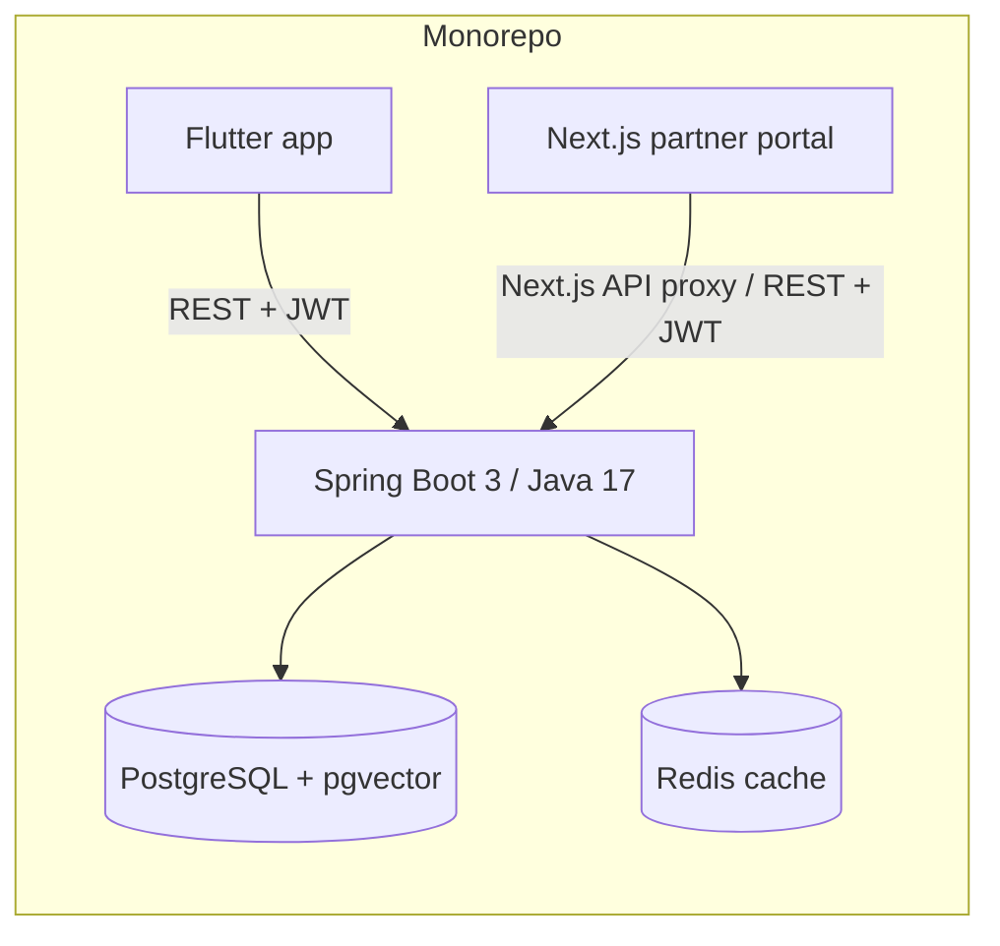
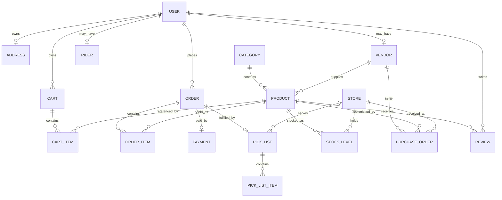

# NearNow Architecture & Design Decisions

## System structure

The supplied repository separates the consumer app, Spring Boot backend, and partner portal. The backend is the shared business/API boundary; the portal is an operations interface over the same role-protected APIs.

## High-level data model

The model is intentionally relational: ownership/authorization is represented through server-side relationships rather than client-supplied identity fields. Product semantic search is kept alongside normal keyword/catalog APIs.

## Decision: Spring MVC rather than WebFlux

The backend remains a conventional Spring Boot MVC application using Spring Web/Spring Security/JPA. The workload is primarily CRUD, transactional business operations, PostgreSQL queries, and role-protected REST APIs. MVC keeps the code aligned with JPA's blocking transaction model and avoids introducing a reactive programming model without a demonstrated end-to-end throughput/latency requirement.

`spring-boot-starter-webflux` is included in `pom.xml` for one narrow reason: `com.nearnow.ai.AiServiceClient` uses `WebClient` as a convenient non-blocking HTTP client for the outbound calls to the internal `ai-service` (FastAPI). This does not make the application reactive — controllers, services, and the transaction/JPA layer are all still standard blocking Spring MVC, and the `.block()` call at each `AiServiceClient` call site keeps those code paths synchronous from the caller's perspective. `WebClient` is used here purely as an HTTP client, not as an architectural shift to WebFlux.

## Decision: 1P inventory model

Stock is represented by a `StockLevel` for a product at a store/warehouse, with the platform controlling the authoritative quantity. Vendor relationships identify who supplies products, while the platform remains responsible for inventory state, picking, restocking, and order fulfillment. This makes quick-commerce fulfillment deterministic: the customer order reserves/consumes platform inventory rather than asking multiple vendors for a real-time marketplace commitment.

The restock system therefore belongs to the inventory domain: thresholds are evaluated against platform stock, and the existing purchase/restock workflow handles replenishment. Production hardening should not duplicate that logic in another service.

By design, a vendor can never initiate a restock request. Only the platform (admin-configured `StockLevel.reorderThreshold`, evaluated automatically by `WarehouseService.checkAndTriggerRestock()`) decides when a `PurchaseOrder` is created. The vendor's role is limited to responding to a `PurchaseOrder` the platform already created — accept, reject, or dispatch — never to originate one. This replaces an earlier, incorrect vendor-initiated `RestockRequest` model.

## Other non-obvious decisions

- JWT is stateless; Spring Security maps JWT roles to `ROLE_*` authorities.
- Product/category browsing is public; admin, warehouse, vendor, and rider domains are role protected.
- Order placement derives price and line items from server-side cart state rather than trusting client totals.
- Payment defaults to `MOCK` unless explicitly configured otherwise.
- Redis is already used as a cache and is not treated as the system of record.
- pgvector supports local semantic product search while normal keyword search remains available as a cheap deterministic path.
- Actuator exposes health/Prometheus endpoints for operational monitoring.
- The partner portal uses Next.js server/session routes as its browser-facing session boundary rather than exposing backend credentials directly to browser code.
